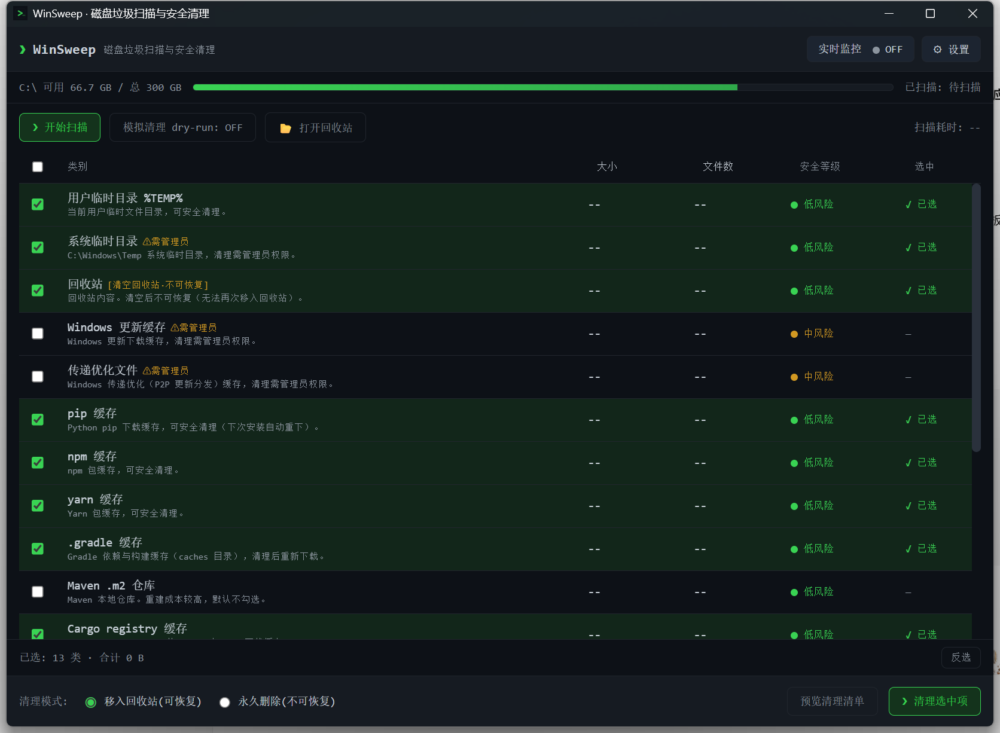
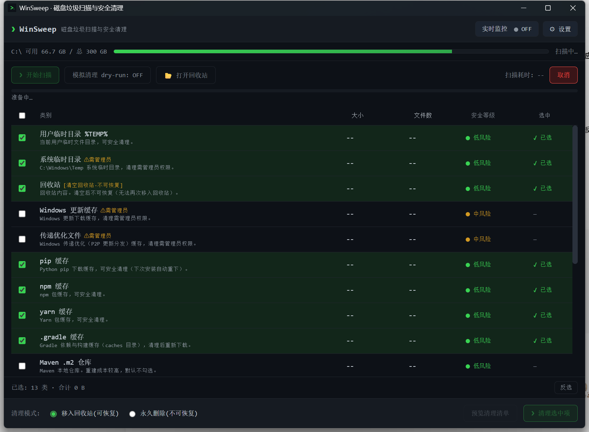
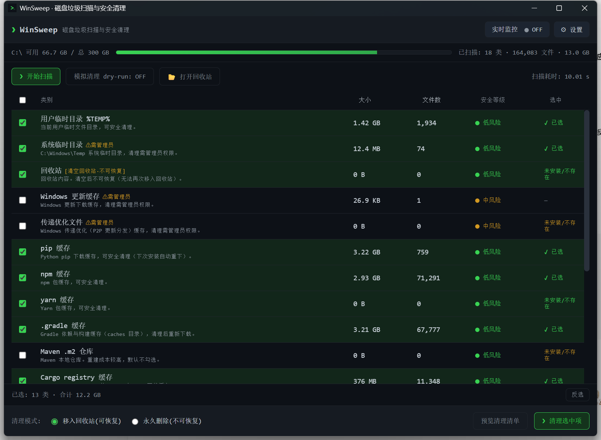

<div align="center">


# WinSweep

**Windows 磁盘垃圾扫描与安全清理工具 · 便携单文件 · 暗色极客风**

小体积（2.83 MB）的 Windows 垃圾检测与安全清理工具。Tauri v2（Rust/MSVC）+ 零框架静态前端，
产出**便携单文件 exe**（无需外部运行时，Windows 10/11 x64）。

<br />

[](https://github.com)
[](https://github.com)
[](./LICENSE)
[](https://github.com)

</div>

---

## 截图

| 主界面 | 扫描中 | 扫描结果 |
|:---:|:---:|:---:|
|  |  |  |

> 截图由 `scripts/capture.ps1` 自动生成（启动 exe → 渲染 → 截取窗口）。

---

## 特性

- **扫得全**：18 类垃圾覆盖系统临时目录、Windows 更新缓存、回收站、pip/npm/yarn/gradle/m2/cargo/go 开发缓存、浏览器缓存、错误报告/转储、缩略图缓存、系统日志。
- **看得清**：类别表按大小/文件数/安全等级展示，可逐项勾选、全选/反选；清理前全量预览（可搜索、可导出 `.txt`）。
- **删得稳**：回收站兜底（默认模式）+ 二次确认 + 黑名单/允许根双重校验 + 占用中文件跳过 + dry-run 零改动。
- **实时监控**：`notify` 监听 + 800ms 防抖，默认关闭、默认仅 `%TEMP%`、默认「仅提醒」；**类型层无永久删除**。

## 目录结构

```
├── ui/                     # 静态前端（= Tauri frontendDist，无打包器）
│   ├── index.html  styles.css  favicon.ico
│   └── js/{api,state,format,render,main}.js
├── src-tauri/
│   ├── Cargo.toml  build.rs  tauri.conf.json
│   ├── capabilities/default.json
│   ├── icons/              # 由 `npx tauri icon` 生成
│   └── src/
│       ├── main.rs         # 入口
│       ├── lib.rs          # 命令层 / IPC 门面 / AppState
│       ├── types.rs        # DTO / 枚举 / AppError
│       ├── categories.rs   # 类别定义 + 路径解析
│       ├── scan.rs         # 扫描引擎
│       ├── clean.rs        # 清理引擎（双模式 / dry-run / 回收站语义）
│       ├── safety.rs       # 安全守卫（黑名单 / 允许根 / 占用探测）
│       ├── watcher.rs      # 实时监控
│       └── win/shell.rs    # Win32 FFI（回收站 / 磁盘）
├── docs/screenshots/       # 界面截图
└── scripts/
    ├── gen_icon.py         # 生成 1024² 图标源图（纯 Python 标准库）
    └── capture.ps1         # 一键截图脚本（PowerShell）
```

## 构建

```bash
# 1) 依赖（仅 @tauri-apps/cli）
npm install

# 2) 图标源图 + 全套图标（icon.ico 缺失会导致 Windows 资源编译失败）
python scripts/gen_icon.py && cp scripts/app-icon.png src-tauri/app-icon.png
npx tauri icon src-tauri/app-icon.png --output src-tauri/icons

# 3) 构建便携 exe（bundle.active=false）
cd src-tauri && cargo build --release
# 或：npm run tauri build
```

产物：`src-tauri/target/release/winsweep.exe`

## 运行

```bash
npm run dev      # 开发（tauri dev）
# 或直接运行 target/release/winsweep.exe
```

## 技术说明

- **零 Tauri 插件**：「打开文件夹/回收站」由自研 `open_path` 调 `explorer.exe` 实现。
- **Win32 FFI**：`win/shell.rs` 以 `extern "system"` 直接绑定 `shell32`/`kernel32`
  （语义与 windows crate 一致，规避版本签名差异并压缩体积）。
- **时间戳**：手写 RFC3339（`std::time`），不引 chrono。
- **体积优化**：`opt-level="z"` + `lto` + `codegen-units=1` + `panic="abort"` + `strip`。

---

## English

**WinSweep** is a lightweight Windows junk-file scanner and safe cleaner, shipped as a
single **2.83 MB portable executable** (no external runtime required; Windows 10/11 x64).
Built with Tauri v2 (Rust/MSVC) and a zero-framework static frontend, in a dark, geeky theme.

### Features

- **Comprehensive scan** — 18 junk categories: system/user temp, Windows Update cache,
  Recycle Bin, dev caches (pip/npm/yarn/gradle/m2/cargo/go), browser caches, crash
  dumps, thumbnail cache and system logs.
- **Clear visibility** — per-category size / file count / safety level, item-level
  selection, full pre-clean preview (searchable, exportable to `.txt`).
- **Safe by design** — Recycle Bin fallback (default mode), second confirmation,
  blacklist/allow-root double validation, skip in-use files, `dry-run` with zero changes.
- **Real-time monitor** — `notify`-based watching with 800 ms debounce; off by default,
  `%TEMP%`-only by default, alert-only by default; **permanent deletion is forbidden at
  the type level** in monitor mode.

### Download

Grab the latest portable build from the **Releases** page, or build it yourself (see below).
The app is a single `winsweep.exe` — no installer, no external dependencies.

### Build

```bash
npm install
python scripts/gen_icon.py && cp scripts/app-icon.png src-tauri/app-icon.png
npx tauri icon src-tauri/app-icon.png --output src-tauri/icons
cd src-tauri && cargo build --release     # -> target/release/winsweep.exe
```

### License

Released under the [MIT License](./LICENSE).
Copyright (c) 2026 在心flow.

---

<div align="center">

Made with ♥ by **在心flow** · Licensed under MIT

</div>
