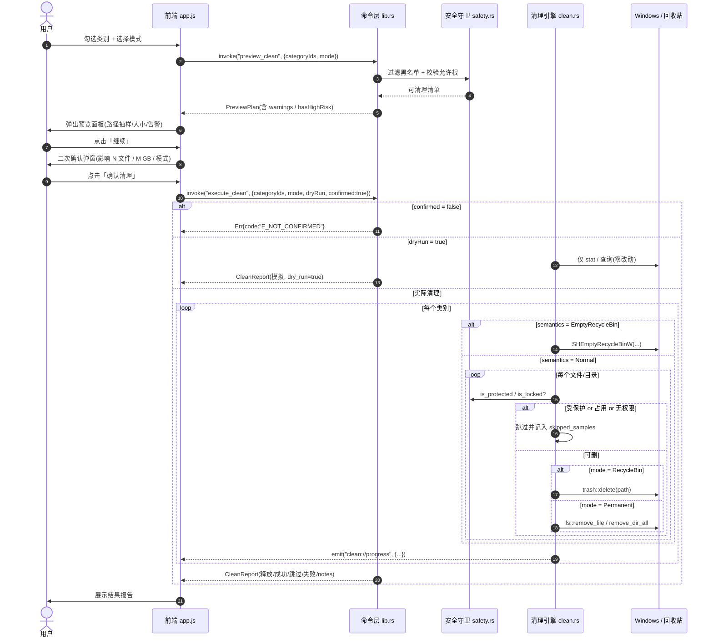
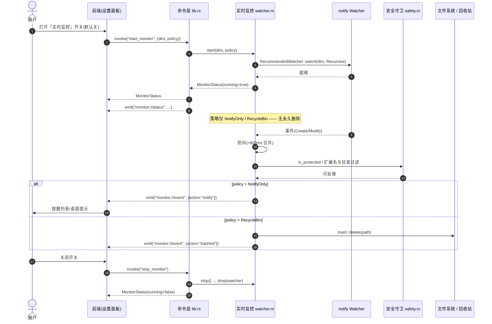
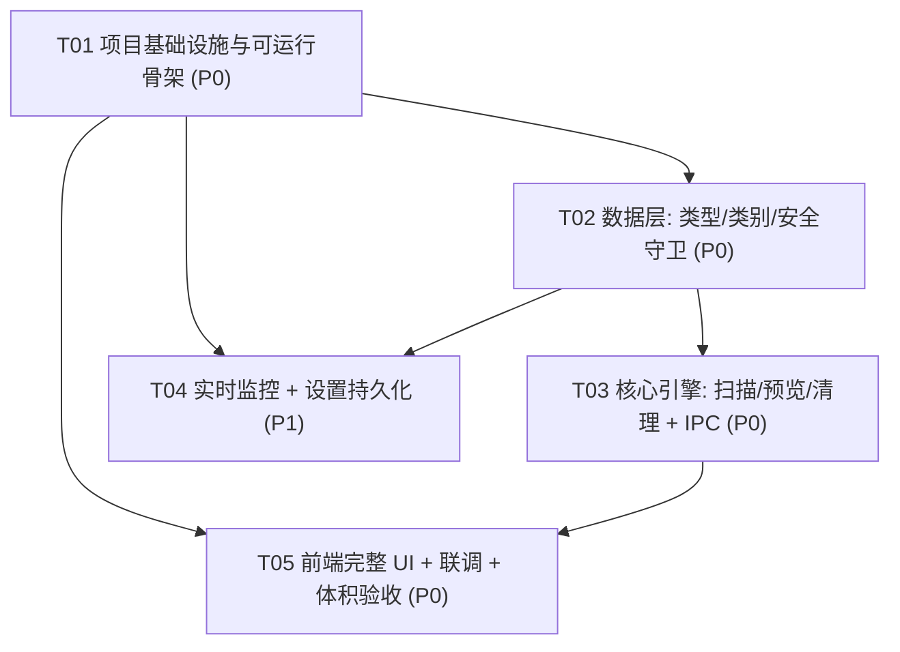

# ARCHITECTURE：WinSweep — Windows 垃圾检测与安全清理工具

> 类型：系统架构设计 + 任务分解（可直接施工）
> 输入：`docs/PRD.md` v1.0
> 技术栈：**Tauri v2 + Rust(MSVC) + 零框架静态 HTML/CSS/JS**
> 目标：Release 单文件便携 exe，**体积 ≤ 15 MB**
> 平台：Windows 10 / 11（x64）
> 语言：简体中文
> 作者：架构师 高见远

---

## 0. 环境事实与选型确认（据实测，勿改）

| 项 | 事实 | 对设计的约束 |
|---|---|---|
| OS | Windows x64 | 全部路径/API 按 Windows 语义 |
| Rust | 1.97.1，toolchain = `stable-x86_64-pc-windows-msvc` | **必须 MSVC 目标**，禁止 GNU |
| 链接器 | MSVC BuildTools 14.44.35207 + Win SDK 10.0.26100 | 可正常链接 exe |
| Node | 22.22.2 / npm 10.9.7 | 用于安装 `@tauri-apps/cli` |
| tauri-cli | **未安装** | **不 `cargo install`**，改用 npm devDependency `@tauri-apps/cli@^2` |
| UPX | 无 | **体积优化不依赖 UPX**，靠 profile + 少依赖 |
| 前端 | 零框架 / 零打包器 | 静态目录直接作为 `frontendDist`，**不引入 Vite/React** |

### 为什么前端走「零框架静态 HTML/CSS/JS」（默认方案）

1. **构建最稳**：无需 Node 构建链，`beforeBuildCommand` 留空，规避 npm/vite 版本漂移。
2. **体积最小**：产物无 JS 框架运行时，Tauri 只嵌入纯静态资源。
3. **满足需求**：本产品 UI 为「表格 + 弹窗 + 进度条 + 设置面板」，原生 DOM 足以胜任，无需虚拟 DOM。
4. **可维护**：仍用 ES Module 拆分为 `js/api.js / state.js / format.js / render.js / main.js`，结构清晰、零依赖。

> **结论**：采用静态方案。这是本项目的**硬性默认**，除非出现原生 DOM 无法实现的交互（目前无）。

### 主理人裁决（直接采纳为设计输入）

| # | 裁决 | 落入设计 |
|---|---|---|
| 1 | 产品名 **WinSweep** | `productName` / 标题 / 目录名 |
| 2 | **普通权限为主**；系统目录失败→跳过并记录 + 提示「以管理员身份重启」；MVP 不自动提权 | `safety.rs` 记 `requires_admin`；`CleanReport.notes` 输出提权提示 |
| 3 | 浏览器缓存**只清缓存目录**，绝不碰 Cookie/登录态/书签，标 **低风险** | 仅枚举 `Cache/Code Cache/GPUCache/cache2`，硬白名单内允许 |
| 4 | 实时监控**默认关**、默认仅 `%TEMP%`、默认「仅提醒」、**禁止实时自动永久删除** | `Settings.monitor_enabled=false`；`MonitorPolicy` 无 Permanent |
| 5 | 首版出**便携版单文件 exe**；NSIS/MSI + 代码签名 = P2 | `bundle.active=false`，`tauri build` 产出 `winsweep.exe` |
| 6 | P2（定时任务/CLI/托盘/多语言）**不进首版** | 不实现 |
| 7 | 首版仅**简体中文** | UI 文案内联中文，不做 i18n 框架 |

---

## 1. 实现方案总述

### 1.1 模块划分

```
┌───────────────────────────────────────────────────────────────────────┐
│                         前端 WebView (ui/)                              │
│  index.html  │  styles.css  │  js/{api,state,format,render,main}.js     │
│  职责：渲染表格/弹窗/进度/报告/设置；听事件；调 invoke；不做任何文件 IO    │
└──────────────────────────────┬──────────────────────────────────────────┘
                 Tauri IPC（invoke 命令 + emit 事件，JSON，camelCase）
┌──────────────────────────────┴──────────────────────────────────────────┐
│                     Rust 后端（src-tauri/src/）                          │
│                                                                        │
│  lib.rs        命令层 / IPC 门面：注册 #[tauri::command]、管理 AppState、  │
│                收发事件、进度节流、取消位                               │
│  types.rs      全部 DTO / 枚举 / AppError / AppState（serde camelCase）  │
│  categories.rs 垃圾类别**定义**与路径解析（含 is_dir 展开、环境变量）      │
│  scan.rs       扫描引擎：walkdir 遍历 + 体量/文件数统计 + rayon 并行      │
│  clean.rs      清理引擎：预览生成、双模式执行、dry-run、回收站语义、报告   │
│  safety.rs     安全守卫：黑名单/允许根校验、占用与权限探测、风险判定       │
│  watcher.rs    实时监控：notify 监听 + 防抖 + 策略（仅提醒/移入回收站）    │
│  win/ shell.rs 平台薄封装：SHQueryRecycleBinW / SHEmptyRecycleBinW /      │
│                GetDiskFreeSpaceExW（windows crate）                     │
└────────────────────────────────────────────────────────────────────────┘
```

| 模块 | 单一职责 | 关键依赖 |
|---|---|---|
| **命令层** `lib.rs` | 唯一 IPC 门面；参数校验；状态与并发控制；事件发射 | tauri |
| **类型层** `types.rs` | DTO/枚举/错误/状态定义；IPC 契约单一事实源 | serde |
| **类别层** `categories.rs` | 类别元数据 + 根路径解析（纯函数，易测） | std / env |
| **扫描引擎** `scan.rs` | 遍历、计量、并行、可取消 | walkdir / rayon |
| **清理引擎** `clean.rs` | 预览、执行、双模式、dry-run、报告 | trash / std::fs / shell |
| **安全守卫** `safety.rs` | 黑名单、允许根、占用/权限探测（**删除前唯一闸门**） | windows |
| **实时监控** `watcher.rs` | 监听、防抖、策略执行（**绝不永久删除**） | notify / trash |
| **平台封装** `win/shell.rs` | Shell API / 磁盘 API 的 unsafe FFI 收敛点 | windows |
| **UI** `ui/*` | 展示与交互，零 IO | 浏览器 DOM |

### 1.2 前端 / 后端边界（强约束）

- **前端不直接触达文件系统**：无任何 fs 插件；一切经 `invoke` 到 Rust。
- **前端不持有路径**：路径只在 Rust 侧由 `categories.rs` 解析；前端只传 `categoryId`。
- **删除的最终裁决在 Rust** `safety.rs`：即使前端伪造类别，也无法删除黑名单路径（双重校验：黑名单 ∩ 允许根）。
- **无 Tauri 插件**：为控体积，不使用 `tauri-plugin-*`；「打开文件夹/回收站」由自研命令 `open_path` 用 `std::process::Command` 调 `explorer.exe` 实现。
- **事件方向单一**：后端 → 前端仅用 `emit`；前端 → 后端仅用 `invoke`（不反向 emit）。

---

## 2. 文件目录树（含职责 + 图标方案）

```
垃圾检测清理工具/
├── docs/
│   ├── PRD.md
│   ├── ARCHITECTURE.md              # 本文档
│   ├── class-diagram.mermaid         # 类图（独立文件）
│   └── sequence-diagram.mermaid      # 时序图（独立文件）
├── package.json                     # 仅承载 @tauri-apps/cli（devDependency）+ 脚本
├── .gitignore                       # 忽略 target/ node_modules/ dist/
├── README.md                        # 构建/运行说明
│
├── ui/                              # ▼ 静态前端（= Tauri frontendDist）
│   ├── index.html                   # 唯一页面：布局骨架（标题栏/工具栏/类别表/底栏/3 个弹窗/设置抽屉）
│   ├── styles.css                   # 暗色极客主题：CSS 变量、表格、进度条、弹窗、动效
│   ├── favicon.ico                  # 页面图标（可复用 icons/icon.ico）
│   └── js/
│       ├── api.js                   # invoke 封装（命令名常量 + 事件订阅封装）+ 统一错误处理
│       ├── state.js                 # 前端内存状态（扫描结果/勾选/模式/设置），含全选/反选
│       ├── format.js                # bytes/百分比/耗时格式化（1024 进制、GB/MB 对齐）
│       ├── render.js                # DOM 渲染：类别表、汇总条、预览面板、确认弹窗、报告、监控面板
│       └── main.js                  # 入口：绑定事件、初始化、串起 api/state/render
│
└── src-tauri/
    ├── Cargo.toml                   # 依赖 + Release 体积 profile
    ├── build.rs                     # tauri_build::build()
    ├── tauri.conf.json              # 应用/窗口/CSP/打包配置（bundle.active=false → 便携 exe）
    ├── .gitignore                   # 忽略 /target
    ├── app-icon.png                 # ★ 图标源（1024×1024），供 `tauri icon` 生成
    ├── capabilities/
    │   └── default.json             # 权限：core:default（自定义命令无需额外权限）
    ├── icons/                       # ★ 由 `npx tauri icon app-icon.png` 生成（勿手写）
    │   ├── icon.ico                 #    Windows exe 资源图标（tauri-build 需要，缺失会 build 失败）
    │   ├── icon.png
    │   ├── 32x32.png
    │   ├── 128x128.png
    │   └── 128x128@2x.png
    └── src/
        ├── main.rs                  # 入口：调用 winsweep_lib::run()
        ├── lib.rs                   # run() + 全部 #[tauri::command] + AppState 填充 + 事件发射
        ├── types.rs                 # RiskLevel/CleanMode/CleanSemantics/ScanStatus/MonitorPolicy
        │                            #   + Category/CategoryResult/ScanReport/DiskInfo/PreviewPlan/
        │                            #     PreviewEntry/CleanRequest/CleanReport/CategoryCleanStat/
        │                            #     SkipRecord/MonitorConfig/MonitorStatus/Settings/
        │                            #     CustomCategory/AppState/AppError
        ├── categories.rs            # CATEGORY_SPECS 常量表 + resolve_roots(id)->Vec<PathBuf>
        ├── scan.rs                  # scan_all/scan_category：walkdir 遍历 + 统计 + rayon 并行 + 取消
        ├── clean.rs                 # build_preview + execute_clean（双模式/dry-run/回收站语义/报告）
        ├── safety.rs                # is_protected / is_within_allowed_roots / is_locked / risk_of
        ├── watcher.rs               # MonitorHandle + start/stop + debounce + 策略执行
        └── win/
            └── shell.rs            # unsafe FFI: SHQueryRecycleBinW / SHEmptyRecycleBinW /
                                    #   GetDiskFreeSpaceExW（收敛所有 unsafe）
```

> `src-tauri/gen/`（Tauri 生成的 schema）与 `src-tauri/target/` 由工具生成，不入库。

### ★ 图标资源方案（避免因缺 icon 导致 build 失败）

1. **准备源图**：`src-tauri/app-icon.png`，正方形 1024×1024（PNG，带 alpha）。
2. **生成全套**（本地执行，**不需要联网**，`tauri icon` 内置于 CLI）：

   ```bash
   npx tauri icon src-tauri/app-icon.png --output src-tauri/icons
   ```
   将生成 `icons/icon.ico`、`32x32.png`、`128x128.png`、`128x128@2x.png`、`icon.png` 等。
3. **兜底**：若暂无设计稿，可用**任意** 1024² PNG 顶替（含纯色即可）先生成一套，保证 `icons/icon.ico` 存在。**`icon.ico` 缺失 = Windows 资源编译失败**。
4. **不要手写/伪造 .ico**；一律用 `tauri icon` 生成，保证多分辨率与格式正确。
5. `tauri.conf.json` 的 `bundle.icon` 指向上述文件；即使 `bundle.active=false`（便携模式），tauri-build 仍读取该图标嵌入 exe。

---

## 3. 数据结构与接口

### 3.1 约定

- 所有跨 IPC 的结构体标注 `#[serde(rename_all = "camelCase")]` → **前端统一用 camelCase 读写**。
- 枚举标注 `#[serde(rename_all = "lowercase")]` → 线上值为 `"low" / "medium" / "high"`、`"recycleBin" / "permanent"`、`"normal" / "emptyRecycleBin"`、`"notifyOnly" / "recycleBin"`。
- 时间统一 **ISO 8601 UTC** 字符串（`chrono::Utc::now().to_rfc3339()`）。
- 字节统一 `u64`；前端负责格式化。
- 命令返回 `Result<T, AppError>`；`AppError` 序列化为 `{ code, message }`，前端按 `code` 分支。

### 3.2 Rust 类型定义（`types.rs`）

```rust
use serde::{Deserialize, Serialize};
use std::path::PathBuf;
use std::sync::atomic::AtomicBool;
use std::sync::{Arc, Mutex};

// ── 枚举 ────────────────────────────────────────────────
#[derive(Debug, Clone, Copy, PartialEq, Eq, Serialize, Deserialize)]
#[serde(rename_all = "lowercase")]
pub enum RiskLevel { Low, Medium, High }

#[derive(Debug, Clone, Copy, PartialEq, Eq, Serialize, Deserialize)]
#[serde(rename_all = "camelCase")]
pub enum CleanMode { RecycleBin, Permanent }

/// 类别的清理语义。EmptyRecycleBin 用于回收站类别（内容无法再"移入回收站"）。
#[derive(Debug, Clone, Copy, PartialEq, Eq, Serialize, Deserialize)]
#[serde(rename_all = "camelCase")]
pub enum CleanSemantics { Normal, EmptyRecycleBin }

#[derive(Debug, Clone, Copy, PartialEq, Eq, Serialize, Deserialize)]
#[serde(rename_all = "camelCase")]
pub enum ScanStatus { Ok, NotFound, Skipped, Error }

/// 实时监控策略：无 Permanent（禁止实时永久删除）。
#[derive(Debug, Clone, Copy, PartialEq, Eq, Serialize, Deserialize)]
#[serde(rename_all = "camelCase")]
pub enum MonitorPolicy { NotifyOnly, RecycleBin }

// ── 类别定义（静态）──────────────────────────────────────
#[derive(Debug, Clone, Serialize)]
#[serde(rename_all = "camelCase")]
pub struct Category {
    pub id: String,               // 稳定 ID，如 "temp_user"
    pub name: String,             // 展示名，如 "用户临时目录 %TEMP%"
    pub risk: RiskLevel,
    pub default_selected: bool,
    pub requires_admin: bool,
    pub semantics: CleanSemantics,
    pub description: String,
}

// ── 扫描结果 ────────────────────────────────────────────
#[derive(Debug, Clone, Serialize)]
#[serde(rename_all = "camelCase")]
pub struct CategoryResult {
    pub id: String,
    pub name: String,
    pub risk: RiskLevel,
    pub default_selected: bool,
    pub requires_admin: bool,
    pub semantics: CleanSemantics,
    pub roots: Vec<String>,       // 已展开的根路径
    pub total_size: u64,
    pub file_count: u64,
    pub status: ScanStatus,
    pub error: Option<String>,
}

#[derive(Debug, Clone, Copy, Serialize)]
#[serde(rename_all = "camelCase")]
pub struct DiskInfo { pub drive: String, pub total_bytes: u64, pub free_bytes: u64 }

#[derive(Debug, Clone, Serialize)]
#[serde(rename_all = "camelCase")]
pub struct ScanReport {
    pub scan_id: String,
    pub started_at: String,
    pub finished_at: String,
    pub duration_ms: u64,
    pub categories: Vec<CategoryResult>,
    pub total_size: u64,
    pub total_files: u64,
    pub disk: DiskInfo,
}

// ── 预览 ────────────────────────────────────────────────
#[derive(Debug, Clone, Deserialize)]
#[serde(rename_all = "camelCase")]
pub struct PreviewRequest { pub category_ids: Vec<String>, pub mode: CleanMode }

#[derive(Debug, Clone, Serialize)]
#[serde(rename_all = "camelCase")]
pub struct PreviewEntry {
    pub category_id: String,
    pub category_name: String,
    pub path: String,
    pub size: u64,
    pub is_dir: bool,
}

#[derive(Debug, Clone, Serialize)]
#[serde(rename_all = "camelCase")]
pub struct PreviewPlan {
    pub category_ids: Vec<String>,
    pub mode: CleanMode,
    pub entries: Vec<PreviewEntry>,   // 抽样上限 MAX_PREVIEW_ENTRIES=1000，避免 IPC 负载过大
    pub entries_truncated: bool,      // 是否被截断
    pub total_files: u64,             // 真实总数（非抽样）
    pub total_size: u64,
    pub has_high_risk: bool,
    pub warnings: Vec<String>,        // 回收站语义 / 需管理员 / 高风险等警示
}

// ── 清理 ────────────────────────────────────────────────
#[derive(Debug, Clone, Deserialize)]
#[serde(rename_all = "camelCase")]
pub struct CleanRequest {
    pub category_ids: Vec<String>,
    pub mode: CleanMode,
    #[serde(default)] pub dry_run: bool,
    pub confirmed: bool,             // 二次确认标记；false 直接拒绝
}

#[derive(Debug, Clone, Serialize)]
#[serde(rename_all = "camelCase")]
pub struct CategoryCleanStat {
    pub id: String, pub name: String,
    pub freed_bytes: u64, pub deleted_count: u64,
    pub skipped_count: u64, pub failed_count: u64,
}

#[derive(Debug, Clone, Serialize)]
#[serde(rename_all = "camelCase")]
pub struct SkipRecord { pub path: String, pub reason: String }

#[derive(Debug, Clone, Serialize)]
#[serde(rename_all = "camelCase")]
pub struct CleanReport {
    pub cleaned_at: String,
    pub mode: CleanMode,
    pub dry_run: bool,
    pub freed_bytes: u64,
    pub deleted_count: u64,
    pub skipped_count: u64,
    pub failed_count: u64,
    pub per_category: Vec<CategoryCleanStat>,
    pub skipped_samples: Vec<SkipRecord>,  // 抽样上限 200
    pub notes: Vec<String>,                // 提权提示 / 回收站语义提示等
}

// ── 实时监控 ────────────────────────────────────────────
#[derive(Debug, Clone, Deserialize)]
#[serde(rename_all = "camelCase")]
pub struct MonitorConfig { pub dirs: Vec<String>, pub policy: MonitorPolicy }

#[derive(Debug, Clone, Serialize)]
#[serde(rename_all = "camelCase")]
pub struct MonitorStatus {
    pub running: bool,
    pub dirs: Vec<String>,
    pub policy: MonitorPolicy,
    pub events_count: u64,
}

// ── 设置 ────────────────────────────────────────────────
#[derive(Debug, Clone, Serialize, Deserialize)]
#[serde(rename_all = "camelCase")]
pub struct CustomCategory { pub id: String, pub name: String, pub path: String, pub risk: RiskLevel }

#[derive(Debug, Clone, Serialize, Deserialize)]
#[serde(rename_all = "camelCase")]
pub struct Settings {
    pub default_mode: CleanMode,
    pub monitor_enabled: bool,
    pub monitor_dirs: Vec<String>,
    pub monitor_policy: MonitorPolicy,
    pub custom_categories: Vec<CustomCategory>,
    pub theme: String,   // "dark" | "black"
    pub font: String,    // "JetBrains Mono" | "Consolas"
}

impl Default for Settings {
    fn default() -> Self {
        Self {
            default_mode: CleanMode::RecycleBin,
            monitor_enabled: false,
            monitor_dirs: vec!["%TEMP%".into()],
            monitor_policy: MonitorPolicy::NotifyOnly,
            custom_categories: vec![],
            theme: "dark".into(),
            font: "Consolas".into(),
        }
    }
}

// ── 应用状态 ────────────────────────────────────────────
pub struct AppState {
    pub cancel: Arc<AtomicBool>,               // 取消当前 scan/clean
    pub busy: Arc<AtomicBool>,                 // 互斥：同一时刻只允许一个重任务
    pub settings: Mutex<Settings>,
    pub monitor: Mutex<Option<crate::watcher::MonitorHandle>>,
}

// ── 错误 ────────────────────────────────────────────────
#[derive(Debug, Clone, Serialize)]
#[serde(rename_all = "camelCase")]
pub struct AppError { pub code: String, pub message: String }

pub type AppResult<T> = Result<T, AppError>;

impl AppError {
    pub fn new(code: &str, message: impl Into<String>) -> Self {
        Self { code: code.into(), message: message.into() }
    }
    pub fn io(e: std::io::Error) -> Self { Self::new("E_IO", e.to_string()) }
}
impl From<std::io::Error> for AppError { fn from(e: std::io::Error) -> Self { Self::io(e) } }

// 错误码常量（前端按此分支）
pub const E_BUSY: &str = "E_BUSY";
pub const E_NOT_CONFIRMED: &str = "E_NOT_CONFIRMED";
pub const E_CANCELLED: &str = "E_CANCELLED";
pub const E_PERMISSION: &str = "E_PERMISSION";
pub const E_INVALID: &str = "E_INVALID";
pub const E_IO: &str = "E_IO";
```

### 3.3 `#[tauri::command]` 函数签名（`lib.rs`）

| 命令名（invoke 用） | 参数（JS 侧 camelCase） | 返回 | 说明 |
|---|---|---|---|
| `get_categories` | —（含 `State<AppState>`） | `Vec<Category>` | 返回全部类别定义（内置 + 自定义） |
| `get_disk_info` | `{ drive: string }` | `DiskInfo` | 默认 C:，供顶部可用空间条 |
| `scan_all` | `{ app: AppHandle, state: State<AppState> }` | `ScanReport` | 全类并行扫描；过程 emit `scan://category`、`scan://progress` |
| `scan_category` | `{ id: string, state }` | `CategoryResult` | 单类扫描（重扫某行用） |
| `preview_clean` | `{ req: PreviewRequest, state }` | `PreviewPlan` | 生成清理清单 + 告警（不落盘、零改动） |
| `execute_clean` | `{ app: AppHandle, req: CleanRequest, state }` | `CleanReport` | 校验 `confirmed`；双模式；dry-run；emit `clean://progress` |
| `cancel_operation` | `{ state }` | `()` | 置 `cancel=true`，walk 循环尽快退出 |
| `get_settings` | `{ app: AppHandle, state }` | `Settings` | 读取（首次从磁盘加载/默认） |
| `save_settings` | `{ app: AppHandle, settings: Settings, state }` | `Settings` | 写盘 + 更新内存 |
| `start_monitor` | `{ config: MonitorConfig, app: AppHandle, state }` | `MonitorStatus` | 启动 notify 监听（默认关，调用即开启） |
| `stop_monitor` | `{ app: AppHandle, state }` | `MonitorStatus` | 停止并 drop watcher |
| `get_monitor_status` | `{ state }` | `MonitorStatus` | 查询当前状态与事件计数 |
| `open_path` | `{ path: string }` | `()` | `explorer.exe` 打开文件夹/回收站/选中文件 |
| `export_preview` | `{ path: string, plan: PreviewPlan }` | `()` | 将预览清单导出为 `.txt`（UTF-8） |

> 说明：
> - Tauri v2 默认将 JS 端 **camelCase 参数键** 自动映射到 Rust 的 `snake_case` 形参；因此 JS 端传 `{ categoryIds, dryRun, monitorDirs }` 即可。
> - `app: AppHandle` / `state: State<AppState>` 为 Tauri 自动注入参数，JS 端**不传**。
> - 命令名保持 `snake_case`，`invoke("scan_all", {...})`。

### 3.4 事件（后端 → 前端，`AppHandle::emit`）

| 事件名 | 载荷（camelCase） | 触发时机 |
|---|---|---|
| `scan://category` | `CategoryResult` | 单个类别扫描完成（rayon 并行，乱序到达） |
| `scan://progress` | `{ scanId, doneCategories, totalCategories, scannedFiles, scannedBytes, currentPath }` | 节流 250ms 一次 |
| `clean://progress` | `{ processed, total, freedBytes, currentPath }` | 节流 250ms 一次 |
| `monitor://event` | `{ path, size, kind: "created"｜"modified", action: "notify"｜"trashed", ts }` | 监控命中新垃圾时 |
| `monitor://status` | `MonitorStatus` | 启动/停止/异常时 |

> Tauri 事件名允许字符：`a-zA-Z0-9 / : _ -`，故 `scan://category` 合法。

### 3.5 前端调用约定（`ui/js/api.js`）

```js
// 命令名集中常量，杜绝手写字符串漂移
export const CMD = {
  getCategories: "get_categories",
  getDiskInfo: "get_disk_info",
  scanAll: "scan_all",
  scanCategory: "scan_category",
  previewClean: "preview_clean",
  executeClean: "execute_clean",
  cancelOperation: "cancel_operation",
  getSettings: "get_settings",
  saveSettings: "save_settings",
  startMonitor: "start_monitor",
  stopMonitor: "stop_monitor",
  getMonitorStatus: "get_monitor_status",
  openPath: "open_path",
  exportPreview: "export_preview",
};
export const EVT = {
  scanCategory: "scan://category",
  scanProgress: "scan://progress",
  cleanProgress: "clean://progress",
  monitorEvent: "monitor://event",
  monitorStatus: "monitor://status",
};
```

```js
import { invoke } from "@tauri-apps/api/core";                 // 无插件依赖，仅核心 API
import { listen } from "@tauri-apps/api/event";
```

> ⚠ 静态前端不经过打包器，无法 `npm import`。**约定**：将 Tauri 的全局注入 API 直接使用 —— Tauri v2 在页面注入 `window.__TAURI__`（当 `app.withGlobalTauri = true`）。**因此 `tauri.conf.json` 需设置 `"app": { "withGlobalTauri": true }`**，前端用 `const { invoke } = window.__TAURI__.core; const { listen, emit } = window.__TAURI__.event;`，无需 import、无需 node_modules。见 §7 配置。

---

## 4. 关键实现要点（避坑清单）

### 4.1 回收站大小探测 —— `SHQueryRecycleBinW`

- **API**：`SHQueryRecycleBinW(pszRootPath: LPCWSTR, pSHQueryRBInfo: *mut SHQUERYRBINFO) -> HRESULT`（`windows` crate：`Windows::Win32::UI::Shell::SHQueryRecycleBinW`）。
- **结构体**：`SHQUERYRBINFO { cbSize: u32, i64Size: i64, i64NumItems: i64 }`，**调用前必须 `cbSize = size_of::<SHQUERYRBINFO>() as u32`**（否则返回 `E_INVALIDARG`）。
- **取全盘**：`pszRootPath = null` → 汇总所有驱动器回收站；或对 `C:\` 单盘查询。
- 返回 `i64Size`（字节）→ `total_size`；`i64NumItems` → `file_count`。`file_count` 为「项数」而非物理文件数，UI 需注明。
- 该类别 `semantics = EmptyRecycleBin`。

### 4.2 ★ 回收站类别在「移入回收站」模式下的语义处理（重点）

**问题**：回收站里的内容**无法再"移入回收站"**——它已经在回收站里。若照搬 `trash::delete`，行为无意义甚至报错。

**方案（明确）**：

1. 回收站类别在**两种模式下都执行"清空回收站"**语义，即调用
   `SHEmptyRecycleBinW(hwnd=null, pszRootPath=null, dwFlags = SHERB_NOCONFIRMATION | SHERB_NOPROGRESSUI | SHERB_NOSOUND)`。
2. **无论用户选「移入回收站」还是「永久删除」**，清空回收站**都是不可恢复操作**，因此：
   - `PreviewPlan.warnings` 追加固定告警：**「回收站内容无法再次移入回收站；将执行『清空回收站』，此操作不可恢复。」**
   - `CleanReport.notes` 同样记录该语义说明。
   - 二次确认弹窗对该类别**红色高亮**提示不可恢复。
3. 用户若**不希望**不可恢复：只需**取消勾选回收站类别**（默认勾选但告警清晰，符合 PRD「回收站 = 低风险」的同时保证知情）。
4. **dry-run 下不调用** `SHEmptyRecycleBinW`，仅报告「将清空回收站，预计释放 0.85 GB」。

> 该设计消除了「模式语义冲突」，且与 PRD §6「回收站兜底」不矛盾：兜底针对**被清理的文件**，回收站类别本身是特殊终结操作。

### 4.3 移入回收站 —— `trash` crate

- 依赖：`trash = "5"`。接口：`trash::delete(path) -> Result<(), trash::Error>`。
- 用于「移入回收站」模式下对 `Normal` 语义类别逐个文件/目录调用。
- 目录：`trash::delete` 支持目录，整目录一次性移入。
- 失败（占用/权限）→ 记入 `skipped_samples`，**不中断**整体清理。

### 4.4 实时监控 —— `notify` crate

- 依赖：`notify = "8"`。`RecommendedWatcher` + `RecursiveMode::Recursive`。
- **默认关闭**：仅当用户点开关（`start_monitor`）才创建 watcher。
- **默认目录**：`%TEMP%`（`Settings.monitor_dirs`）。
- **防抖**：收集事件后用 ~800ms 窗口去重（同一路径多次事件合并），避免 `%TEMP%` 高频写导致事件风暴。
- **策略**：
  - `NotifyOnly`（默认）：仅 `emit("monitor://event", {action:"notify", ...})`，前端弹提醒列表。
  - `RecycleBin`：`trash::delete` 移入回收站后 emit `action:"trashed"`。
  - **无 `Permanent` 分支**，从类型层面杜绝实时永久删除。
- 监听线程与 `MonitorHandle` 生命周期绑定；`stop_monitor` 时 `drop(watcher)` 即停止。

### 4.5 安全守卫 —— `safety.rs`

| 机制 | 实现 |
|---|---|
| **受保护路径黑名单** | 常量前缀表（见下）。删除前对**规范化绝对路径**做前缀匹配，命中即剔除 |
| **允许根校验** | 删除路径必须位于「该类别已解析根路径」之下（`path` startswith `root`），双重保证不越界 |
| **占用/权限探测** | 尝试以 `FILE_FLAG_BACKUP_SEMANTICS` + 独占（`share_mode=0`）打开；失败 → 判为占用/无权限 → 跳过 |
| **dry-run** | `execute_clean` 全程只 `stat` 不 `remove`，零改动 |
| **高风险隔离** | `RiskLevel::High` 的类别 `default_selected=false`；前端勾选时二次警示 |

黑名单前缀（规范化后比较，大小写不敏感）：

```
C:\Windows\System32
C:\Windows\SysWOW64
C:\Windows\WinSxS
C:\Windows\Boot
C:\Windows\Fonts
C:\Windows\assembly
C:\Windows\Microsoft.NET
C:\ProgramData\Microsoft\Windows\Start Menu
C:\Program Files
C:\Program Files (x86)
C:\$Recycle.Bin            # 物理回收站目录，禁止直接 fs 删除（只允许 SHEmptyRecycleBinW）
C:\Recovery
C:\Boot
```

> 注意：`C:\Windows\Temp`、`C:\Windows\SoftwareDistribution\Download`、`C:\Windows\Logs` 等**不在**黑名单（它们是待清理目标），但需 `requires_admin`，失败即跳过并提示提权。

### 4.6 体积控制（Release profile）

```toml
[profile.release]
opt-level   = "z"     # 极致体积；若发现扫描热点过慢可退一档到 "s"
lto         = true
codegen-units = 1
panic       = "abort"
strip       = true
incremental = false
```

- **不引入 UPX**（环境无）。
- **少依赖**：核心仅 tauri / serde / walkdir / rayon / trash / notify / windows / chrono；**不引入 sysinfo**（CPU/内存展示改为可选，见 §8 待明确）。
- 前端零框架 → 静态资源体积极小。
- 预期：WebView2 运行时由系统提供（Win10 1803+/Win11 内置），exe 本体可落在 8–13 MB 区间。

### 4.7 并行扫描（10 万文件 < 30s）

- **类别间并行**：`rayon` 对 `Category` 列表 `par_iter`，各类别互不依赖 → 天然并行，立即吃满多核。
- **类别内遍历**：`walkdir` 单线程 `WalkDir::new(root).follow_links(false)`，`entry.file_type()` 判定，`metadata().len()` 累加。
- **不统计软链接目标**（`follow_links(false)`），避免重复/死循环。
- **进度**：`AtomicU64`（files/bytes）+ `AtomicUsize`（done categories）；后台线程每 250ms `emit` 一次 `scan://progress`。
- **取消**：每个文件/目录迭代检查 `cancel.load(Relaxed)`，命中即 `break` 并返回部分结果，`scan_all` 最终 `Err(E_CANCELLED)` 或标记 `status=Skipped`。
- **权衡理由**：类别数 ~20，若用 rayon 再把单类别内部也并行，收益边际递减且复杂度上升；**类别级并行 + 单类别 walkdir 顺序遍历**已足够，且实现简单、易测。

---

## 5. 程序调用流程（Mermaid 时序图）

### (a) 扫描全流程

```mermaid
sequenceDiagram
    autonumber
    actor U as 用户
    participant UI as 前端 app.js
    participant CMD as 命令层 lib.rs
    participant SCAN as 扫描引擎 scan.rs
    participant CAT as 类别定义 categories.rs
    participant SAFE as 安全守卫 safety.rs

    U->>UI: 点击「开始扫描」
    UI->>CMD: invoke("scan_all")
    CMD->>CMD: busy.check() → true; cancel=false; 生成 scan_id/started_at
    CMD->>CMD: 启动进度线程(每250ms emit scan://progress)
    par rayon 并行遍历各类别
        CMD->>CAT: resolve_roots(id)
        CAT-->>CMD: 展开后的根路径[PathBuf]
        CMD->>SCAN: scan_category(roots, &cancel)
        loop 每个文件/目录(walkdir)
            SCAN->>SAFE: is_protected(path)?
            SAFE-->>SCAN: false
            SCAN->>SCAN: 累加 size / file_count
        end
        SCAN-->>CMD: CategoryResult
        CMD-->>UI: emit("scan://category", CategoryResult)
    end
    CMD->>CMD: get_disk_info("C:")
    CMD->>CMD: busy=false
    CMD-->>UI: ScanReport
    UI->>UI: 渲染类别表格 + 汇总条 + 磁盘条
```

### (b) 预览 → 二次确认 → 双模式清理



### (c) 实时监控流程



---

## 6. 依赖包列表

### 6.1 Rust crates（`src-tauri/Cargo.toml`，版本为实测镜像最新稳定版）

| crate | 版本 | 用途 | 备注 |
|---|---|---|---|
| `tauri` | `2.12`（`"2"`） | 应用运行时 / IPC / 事件 | 默认 feature 即可；**不加插件**以控体积 |
| `tauri-build` | `2` | build.rs 编译期配置 | `[build-dependencies]` |
| `serde` | `1`（`features=["derive"]`） | 序列化 | |
| `serde_json` | `1` | JSON（设置持久化） | |
| `walkdir` | `2.5` | 目录遍历 | 单线程、无软链接跟随 |
| `rayon` | `1.10` | 类别级并行扫描 | |
| `trash` | `5.2` | 移入系统回收站（跨平台） | `trash::delete` |
| `notify` | `8.2` | 文件系统实时监控 | `RecommendedWatcher` |
| `windows` | `0.62` | Win32 API：`SHQueryRecycleBinW`/`SHEmptyRecycleBinW`/`GetDiskFreeSpaceExW`/占用探测 | `features = ["Win32_Foundation","Win32_UI_Shell","Win32_Storage_FileSystem","Win32_System_IO"]` |
| `chrono` | `0.4`（`default-features=false, features=["clock","std"]`） | ISO 8601 UTC 时间戳 | 可选：为省体积可改手写格式化 |

> **不使用**：`sysinfo`（展示 CPU/内存用，见待明确）、任何 `tauri-plugin-*`、`UPX`。

### 6.2 npm devDependencies（`package.json`）

| 包 | 版本 | 用途 |
|---|---|---|
| `@tauri-apps/cli` | `^2` | 提供 `tauri dev` / `tauri build` / `tauri icon`（**不 cargo 全局安装**） |

> 前端**零运行时依赖**（无 React/Vite/Tailwind）；仅通过 `withGlobalTauri` 使用注入的全局 API。

### 6.3 关键配置文件（直接可用，供工程师复制）

**`package.json`**
```json
{
  "name": "winsweep",
  "private": true,
  "version": "0.1.0",
  "type": "module",
  "scripts": {
    "dev": "tauri dev",
    "build": "tauri build",
    "icon": "tauri icon"
  },
  "devDependencies": { "@tauri-apps/cli": "^2" }
}
```

**`src-tauri/Cargo.toml`**（节选，见 §4.6 的 profile）
```toml
[package]
name = "winsweep"
version = "0.1.0"
edition = "2021"
rust-version = "1.77"

[lib]
name = "winsweep_lib"
crate-type = ["staticlib", "cdylib", "rlib"]

[build-dependencies]
tauri-build = { version = "2", features = [] }

[dependencies]
tauri = { version = "2", features = [] }
serde = { version = "1", features = ["derive"] }
serde_json = "1"
walkdir = "2"
rayon = "1"
trash = "5"
notify = "8"
windows = { version = "0.62", features = [
  "Win32_Foundation", "Win32_UI_Shell",
  "Win32_Storage_FileSystem", "Win32_System_IO"
] }
chrono = { version = "0.4", default-features = false, features = ["clock", "std"] }
```

**`src-tauri/build.rs`**
```rust
fn main() { tauri_build::build() }
```

**`src-tauri/tauri.conf.json`**
```json
{
  "$schema": "https://schema.tauri.app/config/2",
  "productName": "WinSweep",
  "version": "0.1.0",
  "identifier": "com.winsweep.desktop",
  "build": {
    "frontendDist": "../ui",
    "beforeDevCommand": "",
    "beforeBuildCommand": ""
  },
  "app": {
    "withGlobalTauri": true,
    "windows": [
      {
        "title": "WinSweep · 磁盘垃圾扫描与安全清理",
        "width": 1100, "height": 780, "minWidth": 900, "minHeight": 640,
        "resizable": true, "center": true, "theme": "Dark"
      }
    ],
    "security": {
      "csp": "default-src 'self'; style-src 'self' 'unsafe-inline'; img-src 'self' data:; script-src 'self'"
    }
  },
  "bundle": {
    "active": false,
    "targets": ["nsis"],
    "icon": [
      "icons/32x32.png", "icons/128x128.png",
      "icons/128x128@2x.png", "icons/icon.ico"
    ]
  }
}
```
> `bundle.active = false` → `tauri build` 只产出便携 exe（`src-tauri/target/release/winsweep.exe`），**不触发 NSIS/WiX 下载**，符合首版便携形态。P2 再置 `true`。

**`src-tauri/capabilities/default.json`**
```json
{
  "$schema": "../gen/schemas/desktop-schema.json",
  "identifier": "default",
  "description": "WinSweep default capability",
  "windows": ["main"],
  "permissions": ["core:default"]
}
```
> 自定义命令（`#[tauri::command]`）**不受权限系统约束**，无需在此声明；`core:default` 已覆盖事件系统。

---

## 7. 任务分解（有序 · 含依赖 · 可施工）

> 硬约束：**任务数 ≤ 5**；每个任务 ≥ 3 个文件；配置文件集中在 T01；尽量减少线性依赖。

### T01 — 项目基础设施与可运行骨架　`P0`

| 项 | 内容 |
|---|---|
| **源文件** | `package.json`、`.gitignore`、`README.md`、`src-tauri/Cargo.toml`、`src-tauri/build.rs`、`src-tauri/tauri.conf.json`、`src-tauri/capabilities/default.json`、`src-tauri/.gitignore`、`src-tauri/src/main.rs`、`src-tauri/src/lib.rs`（仅 `run()` + 空 `invoke_handler` + 注册 `AppState`）、`src-tauri/app-icon.png` + `src-tauri/icons/*`（生成）、`ui/index.html`、`ui/styles.css`、`ui/js/main.js`（最小可跑） |
| **依赖** | 无 |
| **验收** | `npm install` → `npm run icon` 生成图标 → `npm run dev` 能打开暗色窗口；`npm run build` 产出 `winsweep.exe` 且能运行 |
| **要点** | MSVC 目标；`withGlobalTauri:true`；`bundle.active:false`；release profile 体型参数；窗口标题/尺寸 |

### T02 — 数据层：类型 + 类别定义 + 安全守卫　`P0`

| 项 | 内容 |
|---|---|
| **源文件** | `src-tauri/src/types.rs`（全部 DTO/枚举/AppError/AppState/错误码常量）；`src-tauri/src/categories.rs`（`CATEGORY_SPECS` 常量表 + `resolve_roots()`，含全部类别路径与风险/管理员/语义元数据）；`src-tauri/src/safety.rs`（黑名单常量、`is_protected`、`is_within_allowed_roots`、`is_locked` 占用探测、`risk_of`） |
| **依赖** | T01 |
| **验收** | `cargo test`（本地单测）：给定路径能正确判定黑名单/允许根；`resolve_roots` 对未安装工具（如无 yarn）返回 `NotFound` 而不 panic |
| **要点** | 类别 ID 命名见 §8；浏览器类别仅枚举缓存子目录；回收站类别 `semantics=EmptyRecycleBin` |

### T03 — 核心引擎：扫描 + 预览 + 清理 + IPC 命令与事件　`P0`

| 项 | 内容 |
|---|---|
| **源文件** | `src-tauri/src/scan.rs`（`scan_all`/`scan_category`：walkdir + Atomic 计量 + rayon 并行 + 取消）；`src-tauri/src/clean.rs`（`build_preview` 抽样 1000 条 + 告警生成；`execute_clean` 双模式 + dry-run + 回收站空清语义 + 报告）；`src-tauri/src/win/shell.rs`（`query_recycle_bin`/`empty_recycle_bin`/`get_disk_free` 三个 FFI 封装）；`src-tauri/src/lib.rs`（补齐 `scan_all`/`scan_category`/`preview_clean`/`execute_clean`/`get_categories`/`get_disk_info`/`cancel_operation`/`open_path`/`export_preview` 命令 + 事件发射） |
| **依赖** | T02 |
| **验收** | 对一个已知目录扫描体量与资源管理器一致；预览显示告警；`dryRun=true` 后磁盘无变化；`confirmed=false` 返回 `E_NOT_CONFIRMED`；回收站类别在「回收站模式」下弹不可恢复告警 |
| **要点** | `SHQUERYRBINFO.cbSize` 必设；进度节流 250ms；占用/无权限跳过不中断 |

### T04 — 实时监控 + 设置持久化　`P1`

| 项 | 内容 |
|---|---|
| **源文件** | `src-tauri/src/watcher.rs`（`MonitorHandle`；`start`/`stop`/`status`；notify 监听 + 800ms 防抖 + 策略执行，无 Permanent 分支）；`src-tauri/src/lib.rs`（补 `start_monitor`/`stop_monitor`/`get_monitor_status`/`get_settings`/`save_settings`，设置读写至 `app_config_dir/settings.json`） |
| **依赖** | T01、T02 |
| **验收** | 开启后向 `%TEMP%` 写入文件能触发 `monitor://event`；关闭后 `drop` watcher 不再触发；`save_settings` 重启后仍生效；默认 `monitor_enabled=false` |
| **要点** | 默认仅 `%TEMP%`；默认 `NotifyOnly`；禁止永久删除 |

### T05 — 前端完整 UI + 集成联调 + 体积校验收尾　`P0`

| 项 | 内容 |
|---|---|
| **源文件** | `ui/index.html`（完整布局：标题栏/磁盘条/工具栏/类别表/底栏/预览面板/确认弹窗/报告弹窗/设置抽屉）；`ui/styles.css`（暗色极客主题全部样式 + 动效）；`ui/js/api.js`（invoke/event 封装 + `CMD`/`EVT` 常量 + 统一错误处理）；`ui/js/state.js`（勾选/全选/反选/模式/设置）；`ui/js/format.js`（bytes/耗时格式化）；`ui/js/render.js`（表格/进度/弹窗/报告渲染）；`ui/js/main.js`（事件绑定与初始化串联） |
| **依赖** | T03（T01 提供骨架；T04 的监控面板可并行接入） |
| **验收** | 完整走通「扫描→勾选→预览→二次确认→清理→报告」；进度条/数字动效；回收站语义告警以红色呈现；高风险类别默认不勾选且勾选时警示；`npm run build` 后 exe ≤ 15 MB |
| **要点** | 全中文文案；等宽字体堆栈 `"JetBrains Mono", "Cascadia Code", Consolas`；颜色遵循 PRD §5；`withGlobalTauri` 全局 API 用法 |

### 任务依赖图



---

## 8. 共享知识（跨文件约定）

### 8.1 垃圾类别 ID（稳定，勿改；前端与后端共用）

| 顺序 | `id` | 展示名 | 探测方式 / 路径 | 风险 | 默认勾选 | 需管理员 | 语义 |
|---|---|---|---|---|---|---|---|
| 1 | `temp_user` | 用户临时目录 %TEMP% | `%TEMP%` | Low | ✅ | 否 | Normal |
| 2 | `temp_windows` | 系统临时目录 | `C:\Windows\Temp` | Low | ✅ | 是 | Normal |
| 3 | `recycle_bin` | 回收站 | `SHQueryRecycleBinW` | Low | ✅ | 否 | **EmptyRecycleBin** |
| 4 | `windows_update` | Windows 更新缓存 | `C:\Windows\SoftwareDistribution\Download` | Medium | ☐ | 是 | Normal |
| 5 | `delivery_optimization` | 传递优化文件 | `C:\Windows\ServiceProfiles\NetworkService\AppData\Local\Microsoft\Windows\DeliveryOptimization` | Medium | ☐ | 是 | Normal |
| 6 | `pip_cache` | pip 缓存 | `%LOCALAPPDATA%\pip\cache` | Low | ✅ | 否 | Normal |
| 7 | `npm_cache` | npm 缓存 | `%LOCALAPPDATA%\npm-cache` | Low | ✅ | 否 | Normal |
| 8 | `yarn_cache` | yarn 缓存 | `%LOCALAPPDATA%\Yarn\Cache` | Low | ✅ | 否 | Normal |
| 9 | `gradle_cache` | .gradle 缓存 | `%USERPROFILE%\.gradle\caches` | Low | ✅ | 否 | Normal |
| 10 | `m2_repo` | Maven .m2 仓库 | `%USERPROFILE%\.m2\repository` | Low | ☐ | 否 | Normal |
| 11 | `cargo_registry` | Cargo registry 缓存 | `%USERPROFILE%\.cargo\registry\{cache,src}` | Low | ✅ | 否 | Normal |
| 12 | `go_build_cache` | Go build cache | `%LOCALAPPDATA%\go-build` | Low | ✅ | 否 | Normal |
| 13 | `browser_chrome` | Chrome 缓存 | `%LOCALAPPDATA%\Google\Chrome\User Data\*\Cache|Code Cache|GPUCache` | Low | ✅ | 否 | Normal |
| 14 | `browser_edge` | Edge 缓存 | `%LOCALAPPDATA%\Microsoft\Edge\User Data\*\Cache|Code Cache|GPUCache` | Low | ✅ | 否 | Normal |
| 15 | `browser_firefox` | Firefox 缓存 | `%LOCALAPPDATA%\Mozilla\Firefox\Profiles\*\cache2` | Low | ✅ | 否 | Normal |
| 16 | `error_reports` | 错误报告与转储 | `C:\ProgramData\Microsoft\Windows\WER\*` + `%LOCALAPPDATA%\CrashDumps` + `C:\Windows\Minidump` | Medium | ☐ | 是 | Normal |
| 17 | `thumbnail_cache` | 缩略图缓存 | `%LOCALAPPDATA%\Microsoft\Windows\Explorer\thumbcache_*.db|iconcache_*.db` | Low | ✅ | 否 | Normal |
| 18 | `system_logs` | 系统日志 | `C:\Windows\Logs`、`C:\Windows\Panther` | **High** | ☐ | 是 | Normal |

> ⚠ 浏览器类别**仅**枚举 `Cache / Code Cache / GPUCache / cache2` 子目录，**显式排除** `Cookies / Login Data / Bookmarks / History / Web Data`（在 `categories.rs` 硬编码，绝不由通配符放宽）。
> ⚠ `requires_admin=true` 且无权限 → 该类别 `status=Skipped`，报告注明「需管理员权限」，并附「以管理员身份重启」提示。

### 8.2 命名与风格约定

| 约定项 | 规则 |
|---|---|
| **类别 ID** | `snake_case`，语义化、稳定、不复用（见上表） |
| **事件名** | `domain://action`：`scan://category`、`scan://progress`、`clean://progress`、`monitor://event`、`monitor://status` |
| **命令名** | `snake_case`（`scan_all`、`execute_clean`…），前端经 `CMD` 常量引用 |
| **IPC 参数风格** | JS 端 **camelCase** 键（Tauri 自动映射到 Rust snake_case 形参） |
| **JSON 字段命名** | 所有 DTO `#[serde(rename_all="camelCase")]` → 前端**统一 camelCase** |
| **枚举线上值** | 小写/小驼峰：`"low"`、`"recycleBin"`、`"emptyRecycleBin"`、`"notifyOnly"` |
| **时间** | ISO 8601 UTC（`to_rfc3339()`），字段名 `*At` / `ts` |
| **字节** | `u64`，字段 `*Bytes` / `totalSize` / `freedBytes`；前端格式化 |
| **路径** | 一律 **绝对路径 + 反斜杠**（Windows），经 `canonicalize` 后比较 |
| **错误结构** | `{ code, message }`；`code` 用 `E_*` 常量，前端 `switch(code)` 决定提示 |
| **抽样上限** | 预览条目 1000、跳过样本 200（防 IPC 载荷过大） |
| **UI 配色** | 背景 `#0D1117`、面板 `#161B22`、分隔 `#21262D`、主文字 `#C9D1D9`、次要 `#8B949E`、安全 `#39D353`、中风险 `#D29922`、危险 `#F85149` |
| **UI 字体** | `font-family: "JetBrains Mono","Cascadia Code",Consolas,monospace` |

---

## 9. 待明确事项

| # | 事项 | 影响 | 建议默认（无反馈即采用） |
|---|---|---|---|
| 1 | 监控面板是否显示 **CPU / 内存**（PRD §5.5 有该 UI） | 若显示需引入 `sysinfo`（+体积）或用 windows API 自采 | **默认不显示**（首版省体积）；如需，用 `windows` crate 的 `GetProcessMemoryInfo` 自采，不引 sysinfo |
| 2 | 浏览器类别是**合并为 1 行**还是**分 3 行**（Chrome/Edge/Firefox） | 影响表格行数与勾选粒度 | **分 3 行**（粒度更细，符合「看得清」） |
| 3 | `.m2` 仓库是否默认勾选 | Maven 仓库重建成本高 | **默认不勾**（列表出现但需手动选） |
| 4 | 进度展示是否需要**实时当前路径**滚动 | 频繁 emit 影响性能 | **节流 250ms** 展示当前路径，可接受 |
| 5 | 是否需要「导出清单」为 CSV（PRD 仅要 .txt） | 影响 `export_preview` | 首版**仅 .txt（UTF-8）** |
| 6 | 系统日志（High）是否需要更细粒度子分类 | 风险提示文案 | 首版**单一 High 类别 + 强警示** |
| 7 | 自定义类别（P1-4）是否进首版 | 设置面板复杂度 | 数据结构已预留（`custom_categories`），**UI 可后置**；首版可只读展示 |

---

## 附：类图（同 `docs/class-diagram.mermaid`）

```mermaid
classDiagram
    class RiskLevel { <<enum>> Low Medium High }
    class CleanMode { <<enum>> RecycleBin Permanent }
    class CleanSemantics { <<enum>> Normal EmptyRecycleBin }
    class ScanStatus { <<enum>> Ok NotFound Skipped Error }
    class MonitorPolicy { <<enum>> NotifyOnly RecycleBin }

    class Category {
        +String id
        +String name
        +RiskLevel risk
        +bool defaultSelected
        +bool requiresAdmin
        +CleanSemantics semantics
        +String description
    }
    class CategoryResult {
        +String id
        +String name
        +RiskLevel risk
        +bool defaultSelected
        +bool requiresAdmin
        +CleanSemantics semantics
        +Vec~String~ roots
        +u64 totalSize
        +u64 fileCount
        +ScanStatus status
        +Option~String~ error
    }
    class DiskInfo { +String drive +u64 totalBytes +u64 freeBytes }
    class ScanReport {
        +String scanId
        +String startedAt
        +String finishedAt
        +u64 durationMs
        +Vec~CategoryResult~ categories
        +u64 totalSize
        +u64 totalFiles
        +DiskInfo disk
    }
    class PreviewRequest { +Vec~String~ categoryIds +CleanMode mode }
    class PreviewEntry {
        +String categoryId +String categoryName
        +String path +u64 size +bool isDir
    }
    class PreviewPlan {
        +Vec~String~ categoryIds
        +CleanMode mode
        +Vec~PreviewEntry~ entries
        +bool entriesTruncated
        +u64 totalFiles
        +u64 totalSize
        +bool hasHighRisk
        +Vec~String~ warnings
    }
    class CleanRequest {
        +Vec~String~ categoryIds +CleanMode mode
        +bool dryRun +bool confirmed
    }
    class CategoryCleanStat {
        +String id +String name
        +u64 freedBytes +u64 deletedCount
        +u64 skippedCount +u64 failedCount
    }
    class SkipRecord { +String path +String reason }
    class CleanReport {
        +String cleanedAt +CleanMode mode +bool dryRun
        +u64 freedBytes +u64 deletedCount +u64 skippedCount +u64 failedCount
        +Vec~CategoryCleanStat~ perCategory
        +Vec~SkipRecord~ skippedSamples
        +Vec~String~ notes
    }
    class MonitorConfig { +Vec~String~ dirs +MonitorPolicy policy }
    class MonitorStatus {
        +bool running +Vec~String~ dirs
        +MonitorPolicy policy +u64 eventsCount
    }
    class CustomCategory { +String id +String name +String path +RiskLevel risk }
    class Settings {
        +CleanMode defaultMode
        +bool monitorEnabled
        +Vec~String~ monitorDirs
        +MonitorPolicy monitorPolicy
        +Vec~CustomCategory~ customCategories
        +String theme +String font
    }
    class AppState {
        +Arc~AtomicBool~ cancel
        +Arc~AtomicBool~ busy
        +Mutex~Settings~ settings
        +Mutex~Option~MonitorHandle~~ monitor
    }
    class AppError { +String code +String message }

    ScanReport "1" *-- "*" CategoryResult
    ScanReport "1" *-- "1" DiskInfo
    PreviewPlan "1" *-- "*" PreviewEntry
    CleanReport "1" *-- "*" CategoryCleanStat
    CleanReport "1" *-- "*" SkipRecord
    Settings "1" *-- "*" CustomCategory
    CategoryResult ..> RiskLevel
    CategoryResult ..> CleanSemantics
    CategoryResult ..> ScanStatus
    Category ..> RiskLevel
    Category ..> CleanSemantics
    PreviewRequest ..> CleanMode
    PreviewPlan ..> CleanMode
    CleanRequest ..> CleanMode
    CleanReport ..> CleanMode
    MonitorConfig ..> MonitorPolicy
    MonitorStatus ..> MonitorPolicy
    Settings ..> CleanMode
    Settings ..> MonitorPolicy
    AppState ..> Settings
```



---

> 文档版本：v1.0｜架构师 高见远｜技术栈：Tauri v2 + Rust(MSVC) + 零框架静态前端
